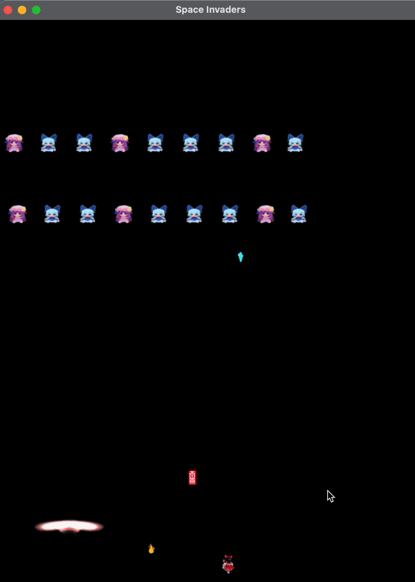

# Fumo Invader

## Description

Fumo Invader in a Java-based game application build using gradle and JavaFX API through IntelliJ. Fumo Invader is a Space Invader inspired game where you can control your character using left and right arrow key and shoot the bullet using space bar key. Your objective is to destroy all the fumo that's approching you from the top of the screen. If the Fumo touch you or go pass you or destroy you with the bullet then it's game over. If you destroy all Fumo, then your won.

## About

Fumo Invader is a program dedicated to educational purpose only. This project allow me to develop my Object-Oriented Programming skill using Design Pattern and Principle such as Factory Method Patter, State pattern, Builder pattern, and Strategy Pattern. Since this is only a part for university project at USYD - SOFT2201 Software Construction and Design 1 given by the task:
> You are required to design an application model for a Space Invaders game. Space Invaders is a classic arcade game played on a rectangular screen with different types of aliens on it. The player controls a spaceship at the bottom of the screen and can shoot projectiles at the aliens. The aliens move horizontally and descend towards the player's spaceship. If the aliens reach the bottom of the screen, shoot the player, or collide with the player's spaceship, the game is lost. The player can move their spaceship horizontally to avoid the aliens' projectiles and shoot them down. The game is won when all the aliens are destroyed. - USYD

The scaffold also provide with the [code base](https://edstem.org/au/courses/12969/lessons/41891/slides/289079) (Only USYD student able to access the code base)

## How to run the program

1. Download this repo to your local machine
2. Open terminal on the directory that you've download this repo
3. Type 'gradle clean build run' in terminal
4. Enjoy

## Design Pattern Class

### Factory method
All class store within bullet package
Creator: BulletFactory
ConcreteCreator: BulletPlayerFactory, BulletEnemyFactory
Product: Bullet
ConcreteProduct: BulletPlayer, BulletEnemy

BulletPlayerFactory and BulletEnemyFactory implements BulletFactory
Bullet is abstract class where BulletPlayer and BulletEnemy will call super() for common constructor, the width and height will be determine differently accorded to each Concrete Bullet class
When calling create it need the owner object to set the position and move strategy class which you will see on Strategy pattern.
It will return the bullet that just create and you can do anything with it in the GameEngine class

### State pattern
All class store within entities package specifically inside bunker_state folder
Context: Bunker
State: BunkerState
ConcreteState: BunkerStateGreen, BunkerStateYellow, BunkerStateRed

All the concrete state bunkers implements BunkerState
Bunker contains BunkerState variable and start with BunkerStateGreen
takeDamage() function got overide to also call state to change
the state then change and acts accordingly to its current state (eg. change image, change color by call from context)

### Builder pattern
All class store within entities package specifically inside builder folder
Director: Director
Builder: Builder
Concrete Builer: BunkerBuilder, EnemyBuilder
Product: Bunker, Enemy

All bunker and enemy are create when start the game
It first initialise the director by takes in the builder type
Then call construct() to loop all bunker or enemy in config json array
Which will build using respective builder
Then return the list to global variable in GameEngine

### Strategy pattern
All class store within bullet package especially inside strategy folder
Strategy: BulletMove
ConcreteStrategy: BulletMoveSlow, BulletMoveFast
Context: EnemyBullet

BulletMoveSlow and BulletMoveFast implements BulletMove
Only EnemyBullet class that contains move strategy
the move strategy call when enemy bullet call move() function
which will trigger the move function inside each strategy differently accorded to what strategy we set when initialise EnemyBullet
Optionally, the strategy can set an image of bullet differently accorded to its ConcreteStrategy

## Extra class
ConfigReader: class had been added to convert json value to more suitable value. This object will be pass down to GameEngine as a resource when starting the game.

GameObject: abstract class for every object in the game. Contains common variable and implement method such as Moveable, Damagable, Rederable, and Collider. Since all of those method can be used to every object that exist in the game. The class also came with abstract method which will call update() function that will call every update() from GameEngine to manage the logic make it easier to read.

Renderable: there had been a lot of change in this class to handle the delete process of an object and setter getter of an image.

## Unused class
BoxCollider, Animation, Animator
(please don't mark these class as it just came with the scaffold and will never used in the engine)

## JSON file changelog
Player color: you can change player color. Right now there's only 3 colors available which is "red", "yellow", and "green". The default color is "red" hence I had made change to JSON file for player color to be "red"

Enemy position: There had been a duplicate enemy position causing them to overlap, I had change half of them to had y position offset by 100.

Bunker position: The original position looks very awkward, so I changed it a bit by moving every thing to the left by 50 pixel.

## Contributor

USYD: https://www.sydney.edu.au/

## Credit

Programmer: Best Phanuwish